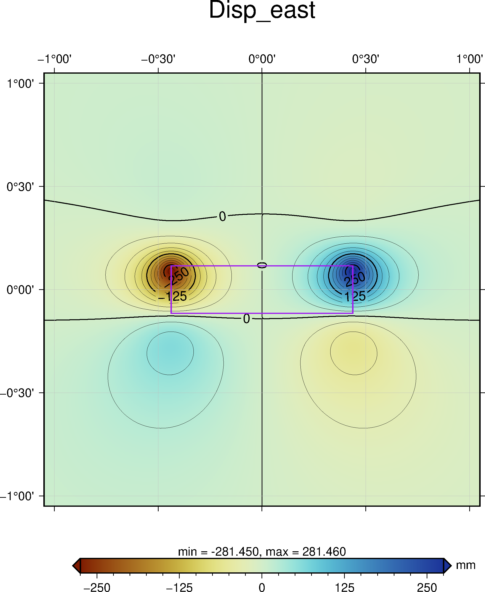

# From pscmp and qsspstatic output to GMT maps

Read and plot the snapshot-form output of **[PSGRN/PSCMP](https://www.gfz-potsdam.de/en/section/physics-of-earthquakes-and-volcanoes/infrastructure/tool-development-lab/#gfz-collapse-c66634)** ([Wang et al., 2006](https://doi.org/10.1016/j.cageo.2005.08.006)) and **[QSSPSTATIC](https://www.gfz-potsdam.de/en/section/physics-of-earthquakes-and-volcanoes/infrastructure/tool-development-lab/#gfz-collapse-c66638)** ([Wang et al., 2017](https://doi.org/10.1093/gji/ggx259)), using [GMT](https://www.generic-mapping-tools.org/) and Matlab, via [GMT-MEX](https://github.com/GenericMappingTools/gmtmex).

### Very abridged context

Both codes are aimed at computing co- and post-seismic deformation (and other geophysical observables, e.g. gravity, tilt) due to *dislocations* (mostly earthquakes). *Snapshot outputs* provide all observables, at all computation points, at a given time. PSGRN/PSCMP models a multi-layered half-space, the so called "flat earth" approximation, while QSSP does so in a spherical earth domain.

This is an overly simplified explanation, to provide context for anyone unfamiliar with the codes.

Refer to the codes authors' papers linked above and note that **I am implying no endorsement by their authors**.

## Usage example

To do: document the example.

## Requirements

* [GMT and GMT-MEX](https://www.generic-mapping-tools.org/), note that building GMT-MEX on Linux is not trivial (see this [gmt-mex issue](https://github.com/GenericMappingTools/gmtmex/issues/8))

* No reliance on any Matlab toolbox (checked with [matlab.codetools.requiredFilesAndProducts](https://www.mathworks.com/help/matlab/ref/matlab.codetools.requiredfilesandproducts.html)). GNU/Octave compatiblity needs to be assessed.

## Stuff that could be improved

This was started as a mean to plot maps for an ad-hoc case, with a comfortable level of automation, as achievable under under quite tight deadlines :)

(and I am not actively maintaining it, since the set goals were met)

Specific issues aside, it has two main pitfalls:

* performing the "snapshot file to maps" step is meant to be abstracted by [`gmtMexGrid2grd`](./gmtMexGrid2grd.m). There is no "one size fits all" solution and automating some parameters (chiefly: major and minor ticks for z-contours and colormap extents) is prone to breaking easily. Map are still produced, but may end up ranging from somewhat unclear to outright ugly. This issue presented clearly already in the specific use case for which these functions were written - choices made in the automation of plotting parameters were hand tailored around those problems. In general use, expect having to fine-tune some parameters which are not exposed as arguments (and should be). So: it is quite a leaky abstraction. 😅

* [`gmtMexGrid2grd`](./gmtMexGrid2grd.m) is quite a monolithic do-it-all function: data loading and processing are kept together with plot production. A radical refactor, defining a "snapshot" class, constitutes a good starting point for improvement.

In addition to these, tests are missing.
